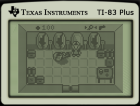
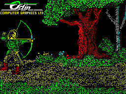
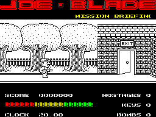
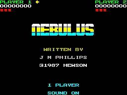
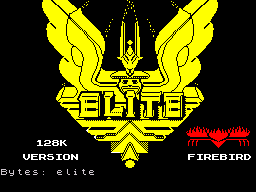

# skoolkit-game-revs
Reverse engineering games using [SkoolKit](https://github.com/skoolkid/skoolkit).

## Highway Encounter (ZX Spectrum)

Original: for ZX Spectrum, 1985.

Volume: about 3900 code instructions.

Browse: https://nzeemin.github.io/skoolkit-game-revs/highwayencounter-zx/highwayencounter/

Status: Not finished (50K .ctl file).

Follow-up projects:
[uknc-highwayencounter](https://github.com/nzeemin/uknc-highwayencounter) •
[bk0011m-hwyenc](https://github.com/nzeemin/bk0011m-hwyenc) •
[vector06c-highwayencounter](https://github.com/nzeemin/vector06c-highwayencounter)

## Desolate (TI-83+)

Original: by Patrick Prendergast for TI-83 Plus calculator, circa 2014.

Volume: about 3200 code instructions.

Browse: https://nzeemin.github.io/skoolkit-game-revs/desolate-ti83plus/desolate/

Status: Not finished, but have a good progress (37K .ctl file).

Follow-up projects:
[spectrum-desolate](https://github.com/nzeemin/spectrum-desolate) •
[uknc-desolate](https://github.com/nzeemin/uknc-desolate) •
[vector06c-desolate](https://github.com/nzeemin/vector06c-desolate) •
[korvet-desolate](https://github.com/nzeemin/korvet-desolate) •
[specialist-desolate](https://github.com/nzeemin/specialist-desolate) •
[orion128-desolate](https://github.com/nzeemin/orion128-desolate) •
[bk0011m-desolate](https://github.com/nzeemin/bk0011m-desolate) by Sandro

## Commando (ZX Spectrum)

Original: for ZX Spectrum, 1985, Elite Systems Ltd.

Volume: about 8300 code instructions.

Browse: https://nzeemin.github.io/skoolkit-game-revs/commando-zx/commando/

Status: Not finished, but have a good progress (62K .ctl file).

## Hydrofool (ZX Spectrum)

Original: by Carter Follis Software Associates for ZX Spectrum, 1987.

Volume: about 4500 code instructions.

Browse: https://nzeemin.github.io/skoolkit-game-revs/hydrofool-zx/hydrofool/

Status: Have some progress (112K .ctl file).

## Scuba Dive (ZX Spectrum)

Original: by Mike Richardson for ZX Spectrum, 1983, Durell Software.

Volume: about 4500 code instructions.

Browse: https://nzeemin.github.io/skoolkit-game-revs/scubadive-zx/scuba/

Status: Work in progress (66K .ctl file).

Follow-up projects:
[vector06c-scubadive](https://github.com/nzeemin/vector06c-scubadive)

## Saboteur (ZX Spectrum)

Original: by Clive Townsend for ZX Spectrum, 1985, Durell Software.

Volume: about 4300 code instructions.

Browse: https://nzeemin.github.io/skoolkit-game-revs/saboteur1-zx/saboteur/

Status: Have pretty good progress (189K .ctl file).

Follow-up projects:
[uknc-saboteur1](https://github.com/nzeemin/uknc-saboteur1) •
[bk0011m-saboteur1](https://github.com/nzeemin/bk0011m-saboteur1) •
[vector06c-saboteur1](https://github.com/nzeemin/vector06c-saboteur1) •
[specialist-saboteur1](https://github.com/nzeemin/specialist-saboteur1) •
[pmd85-saboteur1](https://github.com/nzeemin/pmd85-saboteur1)

## Robin of the Wood (ZX Spectrum)

Original: for ZX Spectrum, 1985, Odin Computer Graphics.

Volume: about 4900 code instructions.

Browse: https://nzeemin.github.io/skoolkit-game-revs/robinofthewood-zx/robin/

Status: Work in progress (43K .ctl file).

## Joe Blade (ZX Spectrum)

Original: for ZX Spectrum, 1987, Players.

Volume: about 3200 code instructions.

Browse: https://nzeemin.github.io/skoolkit-game-revs/joeblade-zx/joeblade/

Status: just started (115K .ctl file).

## Bruce Lee (ZX Spectrum)

Original: for ZX Spectrum, 1984, US Gold.

Volume: about 3500 code instructions.

Browse: https://nzeemin.github.io/skoolkit-game-revs/brucelee-zx/brucelee/

Status: just started (28K .ctl file).
Based on great work done by Anatoly Vdovichev.

## Nebulus (ZX Spectrum)

Original: for ZX Spectrum, 1987, Hewson Consultants.

Volume: about 6500 code instructions.

Browse: https://nzeemin.github.io/skoolkit-game-revs/nebulus-zx/nebulus/

Status: Have some progress (158K .ctl file).
Based on work done by Anatoly Vdovichev.

## Elite 128K (ZX Spectrum)

Original: for ZX Spectrum 128K, 1985, Firebird, by Torus.

Volume: about 13500 code instructions.

Browse: https://nzeemin.github.io/skoolkit-game-revs/elite128-zx/elite/

Status: Have pretty good progress (278K .ctl file).
Based on colossal work done by LW.
